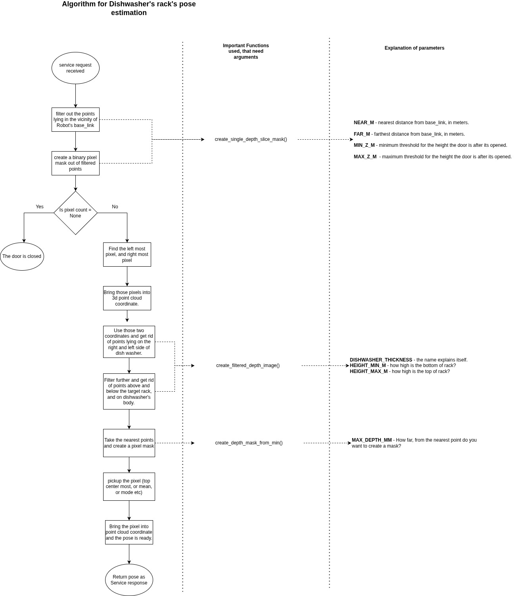
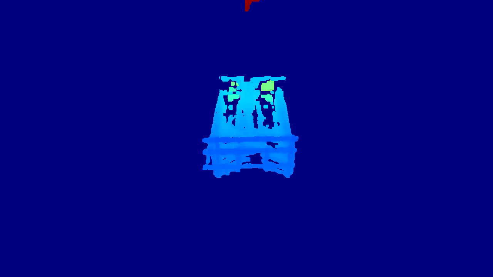
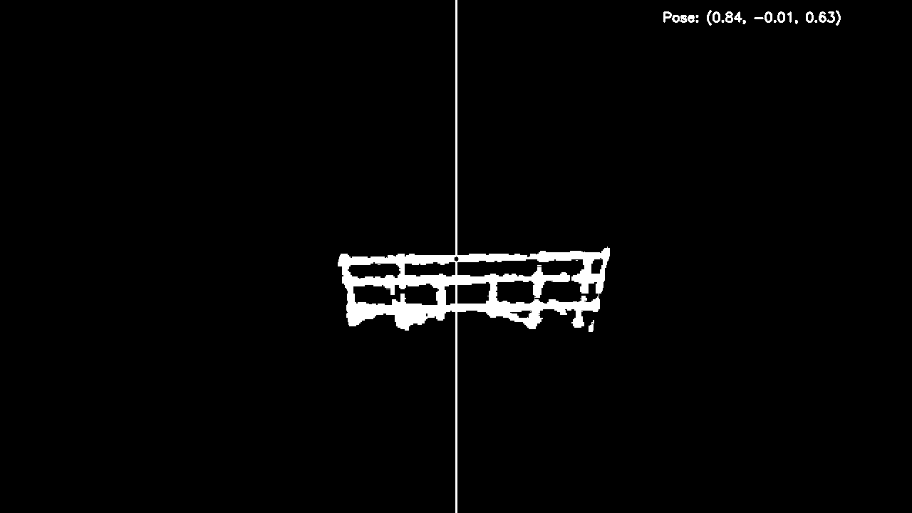

# dishwasher_perception

## Description
Detects if dishwasher is open, estimates pose, estimates the percentage of rack (basket) outside.

Explanation of algorithmn:

Above image's location: documentation/dishwasher's rack's pose estimation algorithmn.jpg

## Visuals

1. filtered depth image:

2. pose estimation:

## Prerequisites
launch file and config file arguments

There are three things to be ready, to make it work:

- [ ]  **Population of the config file**
- [ ]  **Allignment of Robot**
- [ ]  **Head Direction**

    - Head should be pointed at (distance of dishwasher from base_link, 0, 0.3 to 0.35). 
    - Here is an example of point head action request:

    
        - ros2 action send_goal /head_controller/point_head_action   control_msgs/action/PointHead   "{
target: {
header: {
stamp: {sec: 0, nanosec: 0},
frame_id: 'base_link'
},
point: {x: 0.9, y: 0.0, z: 0.3}
},
pointing_axis: {x: 1.0, y: 0.0, z: 0.0},
pointing_frame: 'head_2_link',
min_duration: {sec: 1, nanosec: 0},
max_velocity: 1.0
}"
 
 ## About launch file, and compose files

 ### Launch file:

 The launch file (brinup.launch.py) has three parameters:
 1. **debug**  - if true, shows the debug images (viz., the filtered depth images, the masks).
 2. **cpc_param** - if true, publishes the filtered points of basket.
 3. **markers** - if true, publishes the rviz markers for basket visualization.

 ### Compose files:

There are two compose files:
1. **compose.yml**: Launches the launch file with debug = true.
2. **compose_deploy.yml**: Launches the launch file without debug. Ideally, this should be used during deployment.

## Usage
talk about services

## What's next?

